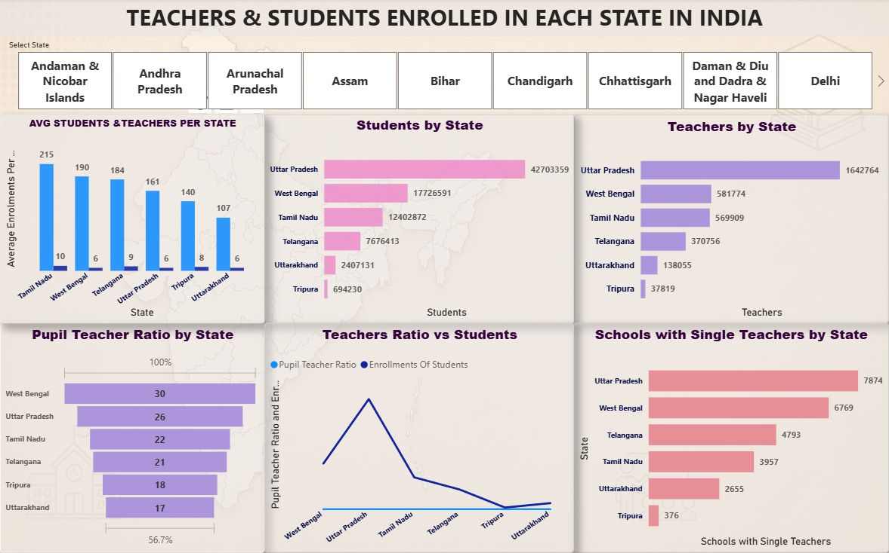
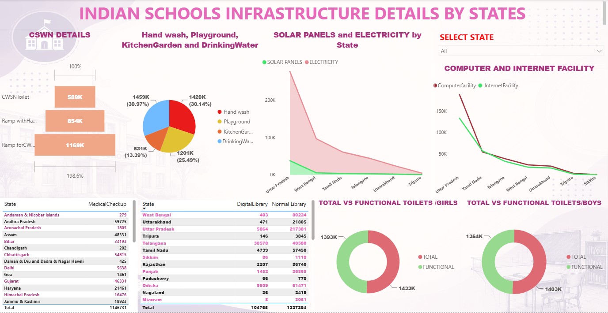

# 🏫 UDISE School Education Analysis — India State-Wise Infrastructure & Enrollment

End-to-end data analytics project on India's **UDISE (Unified District Information System for Education)** data — covering school infrastructure, enrollment, pupil-teacher ratios, and social-category distribution across every Indian State/UT. Built with **SQL, Python, and Power BI** to demonstrate the full analytics workflow: data cleaning → querying → visualization → dashboarding.


---

## 📌 Project Overview

This project analyzes school education statistics using three linked datasets — `school_statistics`, `school_infrastructure`, and `social_category_enrollment` — to answer **30 real-world business questions** using progressively advanced SQL techniques (filtering → aggregation → joins → CTEs → window functions), a Python/Pandas exploratory analysis with visualizations, and an interactive Power BI dashboard.

**Datasets:**
| Table | Description |
|---|---|
| `school_statistics` | Total schools, enrolments, PTR, single-teacher schools, zero-enrolment schools, per-state |
| `school_infrastructure` | Internet, computers, electricity, drinking water, girls' toilets, CWSN ramps — availability & functionality |
| `social_category_enrollment` | Student enrolment share by category — General, OBC, SC, ST, Muslim |

---

## 🗂️ Repository Structure

```
udise-school-education-analysis/
├── sql/
│   ├── 01_basic_problems.sql          # 10 foundational queries (filtering, sorting, aggregates)
│   ├── 02_intermediate_problems.sql   # 10 queries (CASE, subqueries, joins)
│   └── 03_advanced_problems.sql       # 10 queries (CTEs, RANK, LAG, NTILE, PERCENT_RANK)
├── notebooks/
│   └── udise_analysis_python.ipynb    # Python/Pandas EDA + visualizations
├── data/
│   └── udise_dataset_excel.xlsx       # Source dataset (3 sheets, one per table)
├── dashboards/
│   └── udise_analysis_powerbi.pbix    # Interactive Power BI dashboard
├── docs/
│   └── School_SQL_Project_Documentation.pdf   # Full write-up of questions, insights & concepts
├── assets/
│   └── (dashboard screenshots go here)
└── README.md
```

---

## 🧠 SQL Analysis (30 Business Questions)

Questions are split into three difficulty tiers, each in its own `.sql` file:

**Basic** — top states by schools/enrolment, PTR outliers, zero-enrolment schools, national averages
**Intermediate** — single-teacher school %, internet coverage %, OBC enrolment vs. average, PTR banding with `CASE`, toilet/computer functionality gaps
**Advanced** — composite infrastructure score (`CTE`), state rankings (`RANK`), estimated ST enrolment, CWSN ramp accessibility quartiles (`NTILE`), year-over-year style deltas (`LAG`), a multi-table "Opportunity Score," and percentile ranking (`PERCENT_RANK`)

**Concepts demonstrated:** `SELECT` · `WHERE` · `ORDER BY` · `GROUP BY` · `HAVING` · Aggregate Functions · `JOIN` · `CASE` · Subqueries · `CTE` · `RANK()` · `LAG()` · `NTILE()` · `PERCENT_RANK()` · Window Functions (`OVER`)

---

## 🐍 Python Analysis

The notebook (`notebooks/udise_analysis_python.ipynb`) loads and cleans the infrastructure and social-category CSV extracts, merges them into a single state-level dataframe, and explores:
- National overview (total schools, enrolments, teachers, average PTR)
- Top 10 states by school count and by PTR
- Enrolments vs. teachers relationship
- States with the highest concentration of single-teacher schools
- Correlation heatmap across infrastructure metrics

Built with **Pandas**, **Matplotlib**, and **Seaborn**.

---

## 📊 Power BI Dashboard

`dashboards/udise_analysis_powerbi.pbix` presents an interactive, filterable view of the same dataset for non-technical stakeholders — state-wise comparisons, infrastructure KPIs, and enrolment breakdowns by social category.

### Dashboard Preview

**Teachers & Students Enrolled in Each State**
State-wise breakdown of average enrolments per teacher, student and teacher counts, Pupil-Teacher Ratio, and single-teacher school concentration — with an interactive state slicer.



**School Infrastructure Details by State**
CWSN accessibility (toilets, ramps), hand wash/playground/kitchen garden/drinking water availability, solar panels & electricity, computer & internet facility trends, and total-vs-functional toilet breakdowns by gender.



---

## 🔑 Key Insights

1. States differ significantly in school infrastructure and enrolment levels.
2. Higher internet coverage generally indicates better digital readiness.
3. High Pupil-Teacher Ratios may signal teacher shortages in certain states.
4. Single-teacher schools are concentrated in specific, often rural-heavy, states.
5. Zero-enrolment schools may need targeted policy intervention.
6. *Functional* infrastructure (e.g., working toilets/computers) is more meaningful than total counts.
7. Social-category enrolment analysis highlights disparities in access across states.
8. Window functions (`RANK`, `LAG`, `NTILE`, `PERCENT_RANK`) enable rich state-to-state comparison.
9. CTEs simplify composite score calculations (e.g., infrastructure & opportunity scores).

---

## 🛠️ Tech Stack

| Layer | Tools |
|---|---|
| Database / Querying | SQL (MySQL syntax) |
| Data Analysis | Python — Pandas, Matplotlib, Seaborn |
| Visualization / Dashboard | Power BI |
| Source Data | UDISE school education dataset (Excel/CSV) |

---

## 🚀 How to Use

1. **SQL:** Import `data/udise_dataset_excel.xlsx` (or its CSV equivalents) into MySQL as `school_statistics`, `school_infrastructure`, and `social_category_enrollment`, then run the scripts in `sql/` in order (basic → intermediate → advanced).
2. **Python:** Open `notebooks/udise_analysis_python.ipynb` in Jupyter and run all cells (update the CSV file paths to your local paths first).
3. **Power BI:** Open `dashboards/udise_analysis_powerbi.pbix` in Power BI Desktop to explore the interactive dashboard.

---

## 📄 Documentation

Full project write-up with all 30 questions, insights, and concept coverage: [`docs/School_SQL_Project_Documentation.pdf`](docs/School_SQL_Project_Documentation.pdf)

---

## 👤 Author

*Add your name, LinkedIn, and portfolio link here.*
